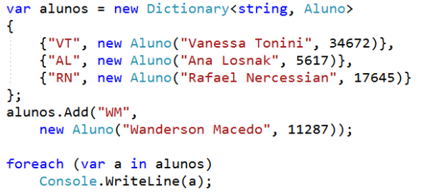
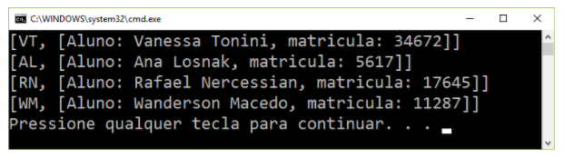
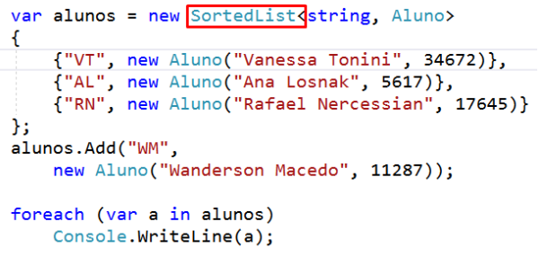
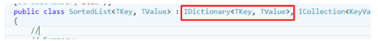
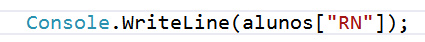
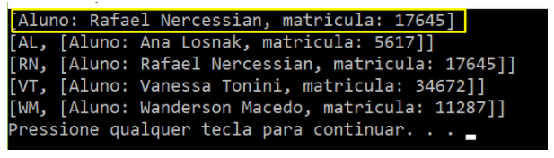
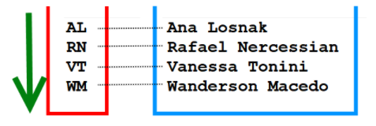

Aula 7
Vídeo 7.1 - SortedList

A próxima classe que veremos é a SortedList<TKey, TValue>. Para ilustrar isso, vamos rever a declaração do nosso dicionário original
com os três alunos iniciais, além de Wanderson Macedo adicionado, e há o loop foreach usual para exibir os valores.

Vamos executar esse código:. 

Nada de novo aqui, mas observe a ordem dos elementos. 
Eles foram enumerados na mesma ordem que os adicionei ao dicionário, que era basicamente uma ordem aleatória.
Agora, eu não confiaria muito nesse comportamento de ordenação. Os dicionários geralmente não têm uma ordem definida, mas é o que acontece neste caso.

E agora vou fazer uma alteração neste código. Vou mudar o tipo de coleção de um dicionário <string, Aluno> para um SortedList <string, Aluno>.

Nada mudou, além da declaração do SortedList. Vamos rodar agora o código. 

Nós obtivemos os mesmos valores, mas olhe a ordem agora. Eles são organizados em ordem alfabética.
Essa ordenação é feita alfabeticamente pela chave, não pelo valor, e isso é um SortedList. É um dicionário que mantém automaticamente seus valores classificados.
Mas não se deixe enganar pelo nome! Para todos os efeitos, um SortedList é um dicionário, ***não uma lista***. 
Ele implementa a interface IDictionary <TKey, TValue>, como podemos ver:

e você a usa basicamente da mesma forma que Dictionary <TKey, TValue>. Como exemplo, posso procurar o valor Rafael Nercessian fornecendo
 A chave "RN". 

Agora vamos executar o código. 

E funciona corretamente! A razão pela qual o nome do tipo é SortedList é devido à implementação interna.

Internamente, é completamente diferente de um Dictionary<TKey, TValue>. Não há tabela de hash. Em vez disso, os elementos são classificados pela chave e
 Em seguida, armazenados basicamente em uma lista. 

Na verdade, duas listas, uma para as chaves e outra para os valores. E o ponto é que, como eles estão classificados pela chave, é muito rápido procurar valores usando a chave.

Ao procurar um elemento, você só pode apenas fazer uma busca binária na lista de chaves. 

 A pesquisa funciona no módulo sobre o tipo Array, e é muito rápido. E a única questão de desempenho é, naturalmente, que, porque estamos usando listas, fazer modificações no dicionário é bastante custoso porque você precisa mover elementos subsequentes para manter a lista ordenada e todos os elementos em sequência. Este é exatamente o mesmo problema de desempenho que o List<T> possui, então não é recomendável adicionar e remover valores em uma SortedList<T> com muita frequência.
Mas se você pode fornecer o SortedList com uma coleção pré-preenchida no construtor e então você não precisa adicionar nenhum elemento depois disso, então o SortedList se torna um dicionário muito bom. Tenha em mente também que, porque está ordenando tudo o que você realmente precisa de chaves que possam ser de maneira significativa comparadas para que os elementos possam ser ordenados. E, como estamos usando strings como as chaves, o .NET já sabe nativamente como ordenar strings.
