>Começando deste ponto? Você pode fazer o [DOWNLOAD](	
https://www.caelum.com.br/favicon.ico) completo do projeto do capítulo anterior e continuar seus estudos a partir deste capítulo.

Aula 8

Vídeo 8.1 - Arrays Multidimensionais

No início do curso vimos como os arrays são um tipo de coleção que ajudam a armazenar informações em posições fixas em memória.

Imagine que você queira agora armazenar os nomes das seleções que ficaram nas primeiras posições nas últimas três copas do mundo:

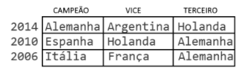

Você poderia armazenar esses nomes dentro de um array de strings. Como são três copas do mundo e três primeiros lugares, então teremos um total de 3 x 3 strings, num total de 9 elementos.

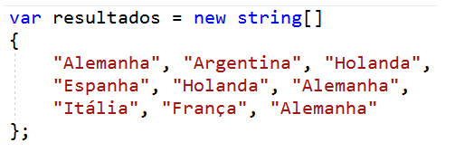

Imprimindo o conteúdo desse array, teríamos uma sequência de strings, como esperado:

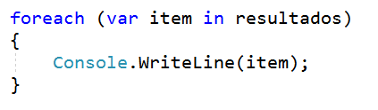

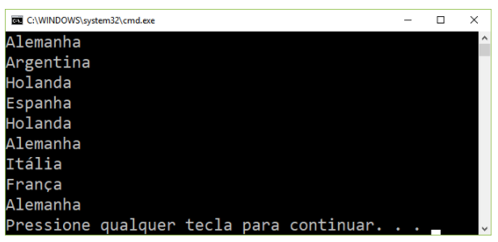

Um array é uma coleção de elementos mantidos em memória sequencialmente, então ser quisermos acessar o vice campeão da copa de 2010, temos que fazer algumas contas: 

> índice = INDICE_COPA * QTD_CAMPEOES_POR_COPA + INDICE_VICECAMPEAO

Como temos:

> INDICE_COPA = 1
QTD_CAMPEOES_POR_COPA = 3
INDICE_VICECAMPEAO = 1

Então:

> índice = 1 * 3 + 1 = 4

Logo, se acessarmos resultados[4], obteremos a string “Holanda”

O problema dessa abordagem é que, para acessarmos elementos específicos desse array de seleções, precisamos calcular o índice de acesso, o que não é muito intuitivo!

O problema que estamos vendo aqui é que estamos tentando encaixar dados de uma “tabela de resultados” dentro de um “array linear”. É mais ou menos como pegar uma fileira de garrafas de cerveja e tentar “adivinhar” qual posição elas ocupariam se tivéssemos que colocá-las ordenadamente dentro de um engradado de cerveja. O problema todo é que uma 
“fileira” de garrafas possui apenas uma dimensão (o comprimento), enquanto um engradado de cervejas é uma matriz com comprimento e profundidade.

Felizmente, o .NET Framework fornece uma outra opção para trabalhar com arrays com mais de uma “dimensão”. Essa opção se  chama arrays multidimensionais:.

A sua inicialização é bastante parecida com a de um array convencional, porém a diferença mais marcante é o uso de vírgulas para definir o tamanho de cada uma das dimensões. Podemos reescrever nosso array de dimensões num modo multidimensional adicionando uma nova dimensão, e assim nosso array ficará com uma dimensão para o “comprimento” (o índice da copa, sendo 0 = Copa 2014, 1 = Copa 2010, 2 = Copa 2006) e outra dimensão para a posição da seleção no campeonato (0 = campeão, 1 = vice, 2 = terceiro lugar).

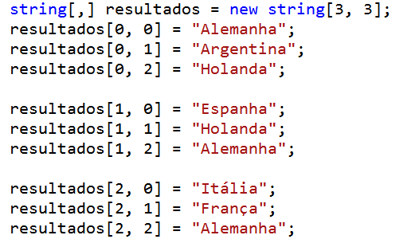

Dessa forma, nosso array ficou mais bem organizado. Podemos ver claramente, pelos índices, como os elementos estão organizados por linhas e colunas na matriz de strings. 

Mas como podemos acessar esses elementos? Vamos reutilizar nosso laço foreach para imprimir os elementos:

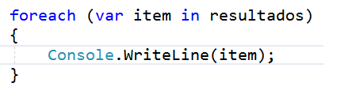

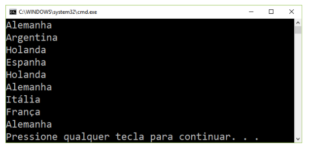

Como vimos pela imagem acima, o acesso aos elementos de um array multidimensional pode ser feito sequencialmente, exatamente como fazemos com array simples!

Isso acontece porque um array multidimensional  é na verdade armazenado em memória exatamente como um array comum! E ele também implementa o método GetEnumerator(), e assim a instrução foreach consegue acessar os elementos sequencialmente.

Podemos melhorar a legibilidade do nosso código introduzindo constantes para mapear os índices das duas dimensões para seus significados. Assim teremos para o primeiro índice:

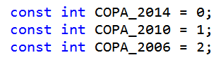

E para o segundo índice:

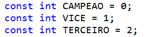

podemos ainda criar um novo array simples para as copas:

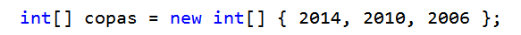

Por fim, vamos armazenar os resultados agora substituindo os “números mágicos” pelas constantes que representam as posições na matriz de seleções:

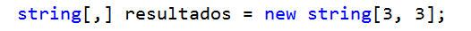

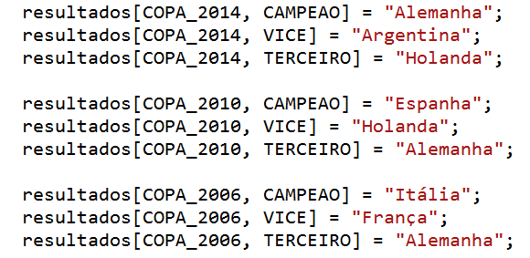

Agora vamos imprimir novamente os elementos. Mas desta vez, como queremos imprimir os resultados graficamente como uma matriz, não vamos usar um simples laço foreach para varrer todos os elementos igualmente.Em vez disso, vamos criar dois laços “aninhados”, sendo um para varrer as linhas e o segundo laço para varrer as colunas da matriz.

O laço externo, varrendo as copas, pode ser escrito como:

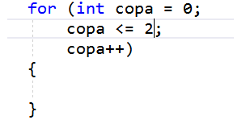

Note que estamos varrendo do índice 0 ao índice 2, porque já sabemos os limites dos índices dessa matriz. Entretanto, também podemos perguntar para o array qual são esses limites. Dessa forma, nosso código poderá trabalhar com arrays multidimensionais de quaisquer tamanho, não apenas 3 x 3!

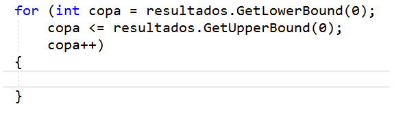

Perceba que os métodos GetLowerBound(0) e GetUpperBound(0) retornam exatamente esses limites. O parâmetro 0 que está sendo passado aqui é justamente para obter dados sobre a primeira dimensão, que é zero.

Agora podemos prosseguir e imprimir também a copa:

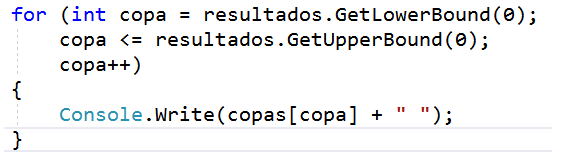

E por fim criamos o segundo laço, novamente usando os métodos GetLowerBound(1) e GetLowerBound(1) para a segunda dimensão (a posição da seleção na copa).

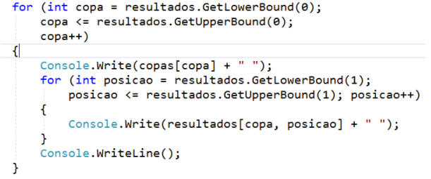

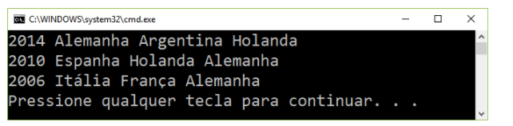

Dessa forma conseguimos construir com sucesso um array multidimensional, que é armazenado em memória tal como um array unidimensional, porém pode ser acessado de maneira mais conveniente para o desenvolvedor!

